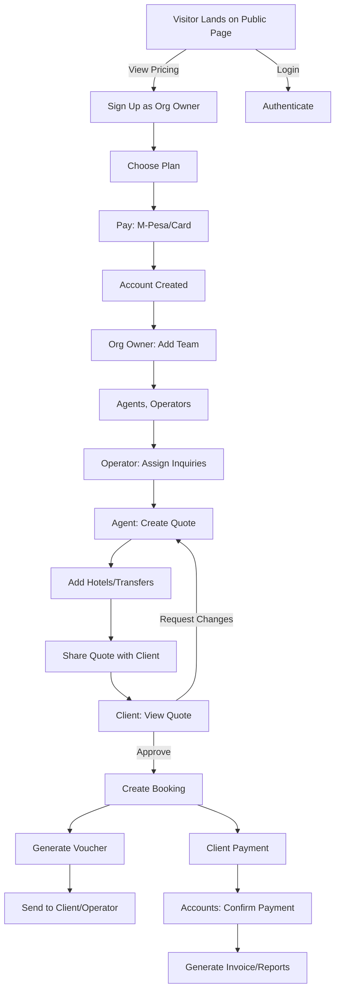
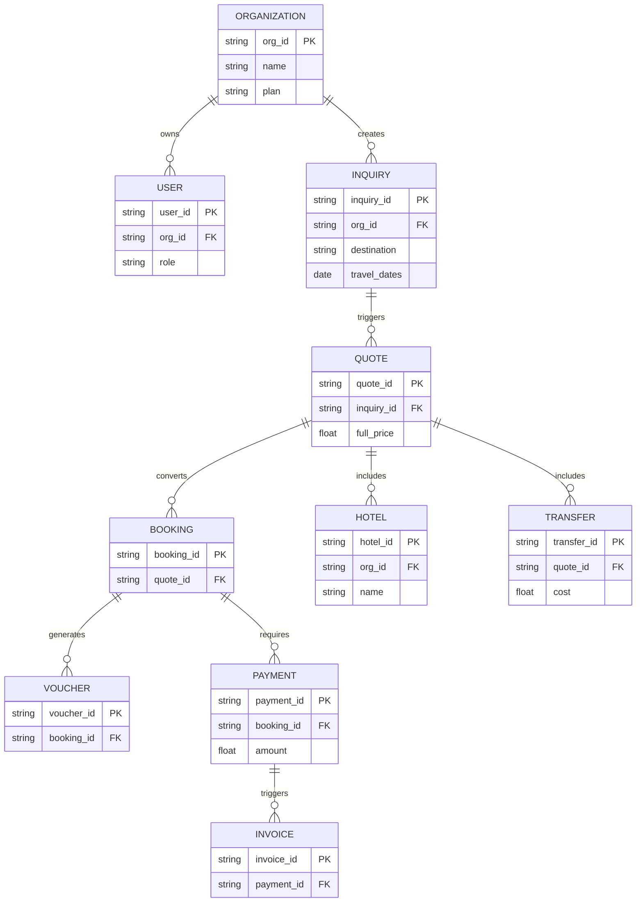
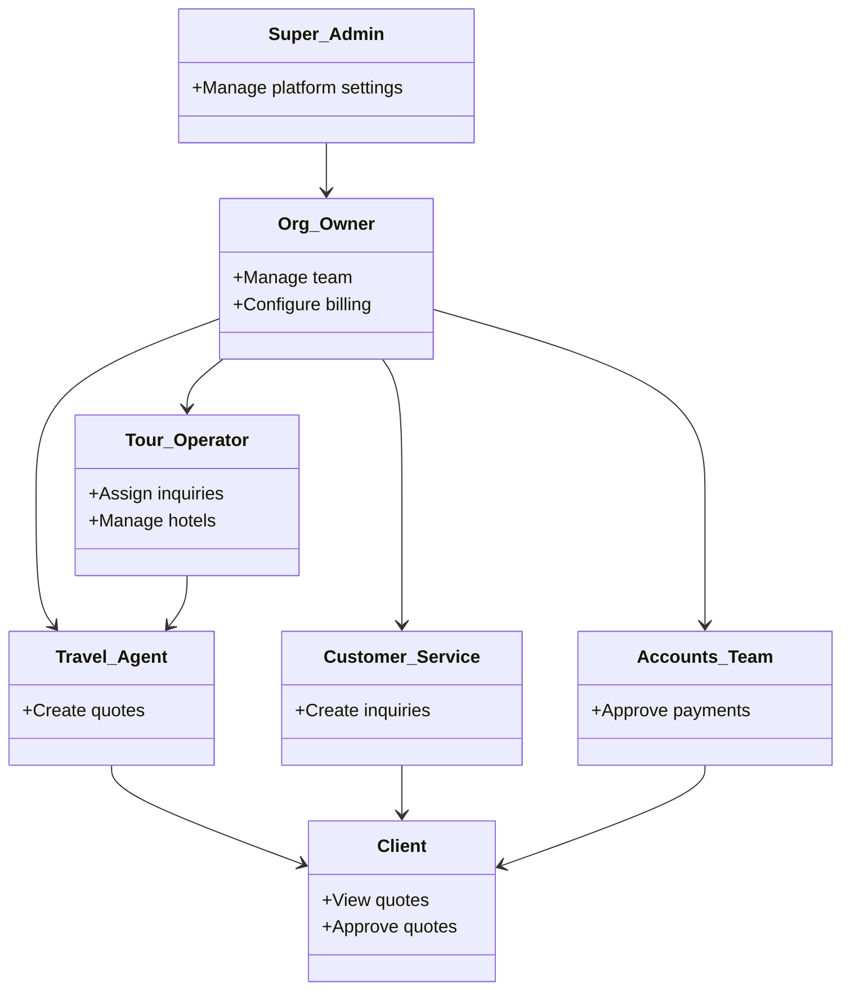
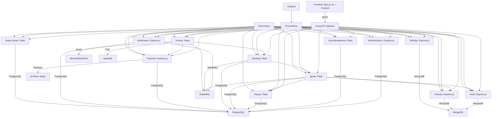

# TravelFlow360

## Overview
TravelFlow360 is a SaaS platform for travel agencies to manage inquiries, quotes, bookings, and payments. Built with a microservice architecture, it uses **Next.js 15**, **Express.js**, **Python Flask**, **Zustand**, **MongoDB**, and **PostgreSQL**, deployed with **Docker** and **Kubernetes**. The platform supports roles like Organization Owner, Travel Agent, and Client, streamlining travel package creation and management.

## Repositories
Below are the repositories for TravelFlow360’s microservices and frontend:

1. **[travelflow360-frontend](https://github.com/TravelFlow360/travelflow360-frontend)**: Next.js 15 frontend with Zustand for state management, providing role-based dashboards and a public landing page.
2. **[travelflow360-authentication](https://github.com/TravelFlow360/travelflow360-authentication)**: For user authentication and RBAC.
3. **[travelflow360-organization-management](https://github.com/TravelFlow360/travelflow360-organization-management)**: Flask service for managing agency setup, team, and billing with PostgreSQL.
4. **[travelflow360-inquiry-management](https://github.com/TravelFlow360/travelflow360-inquiry-management)**: Flask service for creating and assigning client inquiries.
5. **[travelflow360-quote-management](https://github.com/TravelFlow360/travelflow360-quote-management)**: Flask service for generating quotes with markup calculations using.
6. **[travelflow360-hotel-management](https://github.com/TravelFlow360/travelflow360-hotel-management)**: Express.js service for managing hotel lists.
7. **[travelflow360-transfer-transport](https://github.com/TravelFlow360/travelflow360-transfer-transport)**: Express.js service for managing transfer options.
8. **[travelflow360-booking](https://github.com/TravelFlow360/travelflow360-booking)**: Flask service for creating bookings and vouchers.
9. **[travelflow360-payment](https://github.com/TravelFlow360/travelflow360-payment)**: Express.js service for processing payments (M-Pesa, Bank).
10. **[travelflow360-invoice-reporting](https://github.com/TravelFlow360/travelflow360-invoice-reporting)**: Flask service for generating invoices and reports.
11. **[travelflow360-settings-configuration](https://github.com/TravelFlow360/travelflow360-settings-configuration)**: Express.js service for managing agency settings.
12. **[travelflow360-notification](https://github.com/TravelFlow360/travelflow360-notification)**: Express.js service for sending emails.
13. **[travelflow360-super-admin](https://github.com/TravelFlow360/travelflow360-super-admin)**: Flask service for platform-wide settings.


## System Diagrams

### Workflow
The flowchart below shows the end-to-end process from visitor signup to booking and voucher generation.



### Entity-Relationship Diagram (ERD)
The ERD models the database schema for key entities like inquiries, quotes, and bookings.



### User Roles
The class diagram shows the hierarchy and permissions of user roles.



### System Architecture
The architecture diagram illustrates the microservices, databases, and DevOps tools.



## Setup
1. Clone all repositories:
   ```bash
   gh repo clone TravelFlow360/travelflow360-<service-name>
   ```
2. Follow each repository’s README for setup instructions.
3. Configure **Kong API Gateway**, **RabbitMQ**, **Prometheus**, and **Grafana** for integration and monitoring.
4. Deploy using **Docker** and **Kubernetes**.

## Contributing
- See each repository’s `CONTRIBUTING.md` for guidelines.
- Submit issues/PRs to respective repositories.
